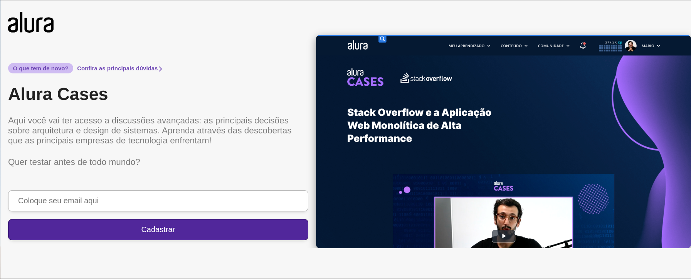

<h1 align="center">Alura Cases - Campanha Curso </h1>

<div align="center">
    
</div>

## 📚 Sobre
O projeto consiste em uma campanha para divulgação de um curso na plataforma Alura, com foco na tecnologia Next.js.

Na prática, foram estudados os comportamentos do Next.js, tais como os métodos getStaticProps e getServerSideProps e suas performances aplicadas no projeto como também foi feito um overview sobre como funciona o Google Analytics.


## 🚀 Tecnologias Utilizadas
- React
- Javascript
- Next.js
- Styled Components


## ⏱️ Iniciar projeto

```bash
# Clone o repositório:
https://github.com/polyanetuag/alura-cases.git

# Instale as dependências
$ yarn install

# Execute o servidor de desenvolvimento:
$ yarn dev

```

## 📋 Licença
Esse projeto está sob a licença MIT. 

---

Desenvolvido com 💜 por Polyane Tuag
